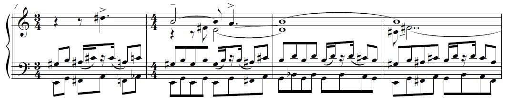
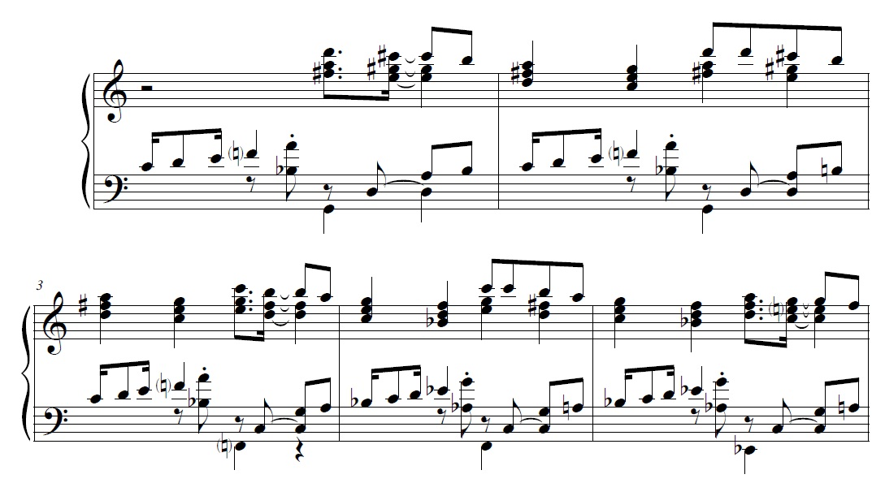
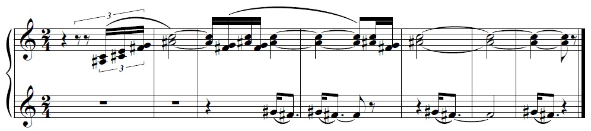
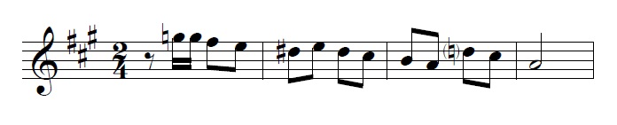
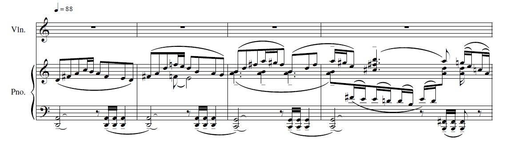

1. O problema da coerência

No Brasil dos anos 1940 e 50, a ideia de uma música de concerto "avançada" só escapava da associação direta com uma linguagem harmônica que tivesse incorporado o total cromático a seu vocabulário e dele fizesse uso ostensivo se quem a compunha circulasse entre comunistas, pois ali o realismo socialista propunha outra ideia de progressismo artístico ancorada na realização de uma música para as "massas", positiva e portadora de valores voltados à sociedade que estaria por vir. Para quem se colocasse numa perspectiva mais distante desse conjunto de ideias ou raciocinasse de um ponto de vista puramente técnico, abandonar o atonalismo poderia significar uma espécie de capitulação, ainda mais que, apesar da vitória localizada do nacionalismo no debate brasileiro daquela década e da seguinte, em termos mais gerais a percepção era de que o caminho do progresso musical passava pelo serialismo e suas derivações.[^1]

Portanto, ao abandonar o dodecafonismo por volta do fim da década de 1940, César Guerra-Peixe se viu diante do problema de como sua música soaria. Preocupava-se em tornar-se nacionalista sem ser "atraído para a órbita de Villa-Lobos",**[REFERENCIA]** e para isso procurava uma forma de trabalhar o material **"folclórico"** que permitisse uma fatura musical afinada com os referenciais da música de concerto do século XX. O problema se torna ainda mais agudo se lembramos que, na tradição de concerto europeia -- e Guerra-Peixe sem dúvida pensava sua música dentro dessa tradição --, problemas relacionados à coerência, à lógica e à inter-relação entre os materiais empregados figuram como uma preocupação fundamental. Originado em outra tradição, o elemento folclórico tenderia a ser sentido como operando, ao menos em certa medida, em outras bases, via de regra essa diferença sendo decodificada na chave de uma discrepância de complexidade entre tratamento e materiais. Tudo isso tendia a criar uma espécie de trabalho extra para fazer esses elementos se encontrarem. Guerra-Peixe chegou a declarar em carta que considerava a "transposição dos elementos populares para a música erudita" um problema "maior que o dodecafônico" (GUERRA-PEIXE, 1951) e isso talvez ajude inclusive a entender por que Guerra-Peixe viria a preferir a composição de temas próprios baseados em características do folclore do que o aproveitamento de materiais em estado bruto colhidos em pesquisa.

2. Constâncias da música brasileira

Mario de Andrade foi explícito ao afirmar, no Ensaio sobre a música brasileira, que "os processos de harmonização sempre ultrapassam as nacionalidades" e que, ainda que haja uma possível "ambiência harmônica" decorrente do emprego de modos e escalas característicos, "a música artística não pode se restringir aos processos harmônicos populares, pobres por demais". Por isso, segundo ele, tudo acabaria coincidindo "fatalmente com a harmonia europeia", ou então deveríamos criar um novo sistema de harmonizar que terminaria por ser falso ou individualista, mas não nacional (ANDRADE, 2006, p. 38-39) É difícil saber até que ponto Guerra-Peixe compartilhou dessas ideias, mas para além do eurocentrismo pressuposto na declaração de Mario, o que se sabe é que Guerra-Peixe via, mesmo num contexto tonal, diferenças entre a harmonia encontrada na música que pesquisava e a tradição europeia, e a importância disso para ele parecia ir além de um simples sabor característico. Comentando, em 1949, a recém-composta Suíte para quarteto ou orquestra de cordas, ele escreveria:

Compus no Recife, experimentando as danças nacionais. Não é composição dodecafônica, pelo contrário empreguei certas *constâncias da harmonia popular brasileira*. (GUERRA-PEIXE, 1949)

Ainda que não saibamos bem o que seriam estas "constâncias da harmonia popular brasileira" na obra, visto que Guerra-Peixe parece também não se contentar com o simples emprego da harmonia encontrada diretamente nas fontes populares que ele mal começava a conhecer. Já em seus compassos iniciais a peça parece se ligar a referenciais harmônicos um tanto distantes do que se imagina como característico de "nossa" música popular:

{width="15cm" height="3.067cm"}

Figura : GUERRA-PEIXE: excerto do Maracatu da Suíte para Quarteto ou Orquestra de Cordas (redução minha - algumas indicações foram suprimidas)

**[REVISAR A DESCRIÇÃO POR CAUSA DOS ACIDENTES QUE NÃO FORAM CONVERTIDOS] Ao conhecer a obra, uma indagação que quase inevitavelmente surge é: qual "popular brasileiro" Guerra-Peixe tinha em mente durante a composição? Como se pode ver na figura, há elementos que talvez se tenha dificuldade em associar diretamente à música que na época se chamaria de "folclórica", como a polimodalidade que atravessa todo o trecho. Neste sentido,um efeito curioso que Guerra-Peixe cria é o movimento de terças paralelas no ostinato na região grave, que, mais tímbrico que propriamente harmônico, segue indiferente à lógica diatônica do modo e toca um sol na voz mais grave que é harmonizado com si pelas violas para, na colcheia seguinte, entoar si(terceiro compasso na figura), o mesmo acontecendo em relação aos pares de colcheias mi/sol-sol/si e fá/lá-lá/dó. Outro efeito interessante, este mais claramente policêntrico, é o que Guerra-Peixe cria com a melodia tocada em semi-imitação pelos violinos. Ali, apesar de não haver propriamente "conflitos" de harmonização ou modo entre o ostinato grave e as vozes superiores, a melodia dos primeiros violinos parece sugerir Si como centro, e não o Mi da harmonia. Isso fica particularmente claro logo no início, quando é feito o glissando lá-si, que soa como um movimento cadencial de subtônica para tônica, desenhando uma resolução em Si mixolídio que evoca uma sonoridade nordestina até um pouco estereotipada. Ainda assim, o mi mais grave tocado pelos segundos violinos, formando uma quinta aberta, tenderia a colocar o centro novamente em Mi, o que acaba sendo compensado pelo fato de que neste momento a harmonia vai para Sol antes de retornar ao Mi em torno do qual o trecho se polariza, mantendo ainda, portanto, alguma ambiguidade.

Por fim, como se pode ver no primeiro compasso mostrado na figura, que faz a transição entre os seis compassos de introdução onde se firma o ostinato e a primeira frase, há um movimento cadencial que dá a cor modal da peça, sugerindo claramente uma sonoridade lídia devido ao acorde maior sobre o II grau da escala.

Também no Pedinte, terceiro movimento da Suíte n^o^ 2 -- Nordestina, para piano, de 1954, vemos mais uma vez sobreposições de modos diferentes:**

{width="13cm" height="7.28cm"}

Nos dois primeiros compassos mostrados na figura, a mão esquerda toca um ostinato em Sol mixolídio, organizado primeiro pela sobreposição de quintas (sol-ré-lá) e depois subindo por graus conjuntos mas contendo um si cuja importância parece mais timbrística do que harmônica, a sétima "seca" produzida junto com o lá fazendo uma espécie de pontuação até um pouco percussiva. Sobre esse Sol mixolídio, o motivo principal da peça faz o movimento descendente ré-dó-si-lá-sol, cujo dó sugere o modo lídio em Sol. É interessante observar a exploração das características dos modos: Guerra-Peixe escolhe o som típico do lídio na música nordestina brasileira ao colocar na síncope a quarta aumentada, dando-lhe proeminência métrica; ao mesmo tempo, o ostinato ascendente na mão esquerda coloca o fá em destaque ao atingi-lo por movimento ascendente, repetindo também um uso bastante comum do mixolídio.[^2] Isso por si só teria como resultado o modo lídio com 7^a^ abaixada, não fosse o fato de que o fá aparece na mão esquerda e que o motivo lídio descendente da mão direita é harmonizado em tríades paralelas que sugerem outras coleções diatônicas -- primeiro o lídio em Ré, que possui fá, e em seguida o mesmo modo em Dó --, resultando da interação vertical entre mão direita e esquerda as já comentadas tríades, às quais é adicionado um som a uma segunda de distância de qualquer de seus componentes.

Dentre as muitas perguntas que emergem da observação de trechos como estes, duas interessam particularmente: 1. existe algum princípio organizador por trás das sobreposições de modos e centros que Guerra-Peixe realiza aí? 2. por que Guerra-Peixe opta por tratar o material popular especificamente dessa maneira?

A primeira pergunta está ligada a um tema que precisará ser abordado em outro momento, por extrapolar consideravelmente os limites deste trabalho. Teremos de nos contentar aqui em observar que **Guerra-Peixe recorreu a princípios harmônicos que ele considerava mais gerais para trabalhar com materiais provenientes de diferentes tradições, permitindo-lhe abarcar e manifestar diferenciações e especificidades presentes nos elementos que eram postos em contato em sua nova música. Uma das características fundamentais desse conjunto de princípios é que, ao menos teoricamente,eles permitiriam a criação de centros, de polos de atração como a tônica na música tonal, mesmo quando se construíssem linhas melódicas tão tortuosas ou aglomerados sonoros tão complexos quanto aqueles praticados pelos atonalistas. Ao mesmo tempo, afirmava Guerra-Peixe, esta prática se ancoraria em fenômenos naturais, sendo portanto agnóstica em relação a estilo, gênero, época e local. Em suas palavras, "é harmonia pelo intervalo" *[VER ISSO DIREITO, TEM ESSA CITAÇÃO NO ARTIGO SOBRE HARMONIA ACÚSTICA]* e, em consonância com isso, seguindo Koellreutter, ele chamava tais práticas de Harmonia Acústica. Pode-se encontrar uma discussão do tema em *[REFERÊNCIA DA TESE]*. Importa reter, no entanto, que daí se tornava possível juntar elementos da música "folclórica" com procedimentos da música de concerto do século XX, produzindo uma estruturação lógica da dimensão harmônica da peça e mantendo a centricidade que Guerra-Peixe enxergava na música que encontrava em suas pesquisas, porém sem prender-se completamente ao tonalismo ou à simples aplicação de sua lógica a outros modos.**

**Para além da discussão sobre Harmonia Acústica, o próprio procedimento de sobrepor centros, tonalidades e modos merece discussão específica e é precisamente onde se cruzam as duas perguntas feitas acima, sendo o que vai nos ocupar pelo resto deste texto.** Todos esses recursos parecem servir para "nublar" -- ou "diluir", para usar o termo empregado por Guerra-Peixe -- o excessivamente característico do modo, ao que se soma ainda o procedimento que consiste em transpor diretamente, de maneira abrupta até, o material apresentado. É o que se pode ver no terceiro compasso mostrado na figura acima (quinto compasso na partitura da peça), quando há a transposição literal de tudo o que foi apresentado para Fá, um tom abaixo do original. Em seguida Guerra-Peixe transpõe para Mi, agora já com alguma variação, o motivo sendo apresentado em Ré dórico, aumentando a tensão do trecho devido à maior "discrepância" harmônica entre o ostinato e o tema. Assim, a música vai escurecendo, de Sol a Mi passando por Fá, para depois passar por mais uma transposição, esta em Mi, que inicia um crescendo harmônico que leva de volta a Sol, quando é introduzido um segundo tema -- claramente derivado das colcheias repetidas do primeiro motivo -- que serve de base para a curta seção central, onde o crescendo continua até o clímax da peça, quando então a tensão diminui progressivamente -- sendo digno de nota como Guerra-Peixe reexpõe a primeira seção da peça com a tensão harmônica desta vez em decrescendo.

A sobreposição de modos e tonalidades diferentes, muito presente especialmente nas obras de Guerra-Peixe desse período, é um dos meios pelos quais ele criava os crescendi e decrescendi harmônicos cuja importância estrutural em diversas de suas peças não deve ser subestimada **[REFERENCIA DA HORA ME QUE FALO DO MELOS NA TESE]**. Além disso, o recurso à politonalidade e à polimodalidade parecia ser uma forma de produzir uma textura cromática usando material folclórico, que tenderia a ser diatônico. Assim Guerra-Peixe não descaracterizaria o material, mas conseguiria também uma complexidade maior, o que aparecia como um traço importante em obras da tradição de concerto. Basta ver que a "simples" harmonização de temas populares tendia a ser encarada pelos compositores nacionalistas da época como um trabalho menor (Cf. ANDRADE, 2006b), uma vez que estaria de certo modo "aquém" de pelo menos dois traços fundamentais do que era visto como o métier do compositor na tradição de concerto da época: criação ou ao menos elaboração dos elementos básicos de uma obra e construção de estruturas de longo alcance.

Nessa discussão, a noção de modo desempenha um papel mais importante do que pode parecer em princípio:[^3]

> Não uso a palavra *modo* empregando o primitivo sentido, o sentido de constâncias melódicas (ao *modo de Frígia*, ao *modo de Lídia*). Porque, realmente, *tudo aqui se modificou*. Faço esse esclarecimento para dizer, depois, que apenas se conservou entre nós o *sabor arcaico das monodias*. Mas estas monodias nossas já são outra coisa, e difere daquilo que se conhece na Europa (pelo menos foi o que pude concluir, ao examinar diversos volumes). Embora eu não concorde com a apresentação de esquemas escalares para explicar melodias populares,fato é que somente isso nos resta. (**GUERRA-PEIXE, 1956, itálico meu, negritos do autor**)

O assunto é complexo e além disso a formulação de Guerra-Peixe não é muito precisa aqui. Por um lado, ele diz que não usa "a palavra modo empregando o primitivo sentido, o sentido de constâncias melódicas", fazendo parecer que um modo seria para ele apenas uma estrutura escalar, mas em seguida diz que as monodias que encontrou em suas pesquisas "já são outra coisa", o que sugere que na verdade o que haveria é incompatibilidade entre as características que certas estruturas escalares assumem na música europeia e na música que ele encontrou em campo. Assim, o problema seriam os nomes dos modos, e não a ideia de modo como "constância melódica". Guerra-Peixe teria então na verdade simplesmente usado os nomes da tradição europeia -- frígio, lídio, dórico etc. -- por uma questão de compreensibilidade, ficando por ser explicado o caráter[^4] diferente que essa estrutura assume em cada tradição. Não se trata de negar que o pesquisador Guerra-Peixe pensasse em modos enquanto coleções de alturas com um centro definido ao analisar determinada manifestação folclórica, mas ele não necessariamente precisaria olhar para a música folclórica e retirar dali um raciocínio modal. O compositor poderia partir, como ele parece ter feito em alguns momentos, da presença e principalmente do que ele chama de caráter de determinados intervalos, sem enquadrá-los em modos,ou então olhar para aquelas estruturas simplesmente do ponto de vista da inclinação a outras regiões ou mesmo como cromatismo, submetendo tudo aquilo ao sistema tonal... As possibilidades são muitas.

Sem renunciar a "cromatizações", "flutuações"[^5] e recursos similares, Guerra-Peixe parecia estar buscando a sonoridade que percebia como característica de cada modo nas diversas manifestações folclóricas que pesquisou, o que significava muitas vezes deixar de lado os modos que se encontram na música europeia, mesmo nos casos em que as estruturas escalares coincidissem. Assim, quando insere cromatizações nos modos ou muda de centro, Guerra-Peixe parece tentar manter a sonoridade característica do modo no plano melódico, o que é interessante diante do fato de que, como venho argumentando, o acompanhamento muitas vezes tem por objetivo "nublar" o som "puro" do modo, no que parece uma busca por produzir complexidade e ambiguidade, **como vimos nas breves análises apresentadas acima.**

Se por um lado o afastamento de uma sonoridade mais próxima do veio principal da tradição de concerto não causa surpresa em um compositor brasileiro preocupado com a criação de uma música que pudesse ser identificada com sua nacionalidade, essa preocupação em complexificar o material colhido no folclore ao transpô-lo para a realidade da música de concerto e os meios empregados para fazê-lo merecem alguma atenção. Apesar do discurso de que o que importava era a música brasileira, que ser moderno nos moldes que o dodecafonismo oferecia não tinha importância,[**BARROS, 2013, cap. 1, seção**] essa alegada ligação mais forte com a música brasileira que com uma ideia de música moderna parecia ter seus limites. Ao que parece, a música de concerto de Guerra-Peixe nunca se afastou completamente de referenciais dessa tradição que lhe eram contemporâneos. Isso pode ser comprovado, por exemplo, quando vemos Bartók apontar no *Pribaoutki* de Stravinsky procedimentos muito similares aos que discuti mais acima a respeito da relação entre melodias de inspiração folclórica com perfil mais diatônico participando em texturas de caráter fortemente "cromático" em obras de Guerra-Peixe. Para Bartók, a parte vocal consiste em motivos curtos que Stravinsky imita da música folclórica russa. Tomados separadamente, esses motivos são absolutamente tonais, mas recebem como acompanhamento uma série de fragmentos mais ou menos atonais que, ainda assim, guardam algo de característico dos motivos. 

The vocal part consists of motives which ... throughout are imitations of Russian folk music motives. The characteristic brevity of these motives, all of them taken into consideration separately, is absolutely tonal, a circumstance that makes possible a kind of instrumental accompaniment composed of a sequence of underlying, more or less atonal tone-patches very characteristic of the temper of the motives. (**BARTÓK, apud ANTOKOLETZ, data, p. 94**)

Ir para o Recife e para o interior de São Paulo fazer pesquisa folclórica não significou portanto trocar completamente a música de concerto de sua época por uma suposta "música brasileira" ainda por ser criada. Ao contrário, havia uma preocupação em ligar sua música à contemporaneidade pela via da tradição de concerto ocidental. Muitos dos mecanismos a que Guerra-Peixe recorreu foram oferecidos pela própria tradição de concerto em seu veio "moderno". Muitas seriam as possibilidades de responder em termos musicais a tais desafios. Há que se considerar, portanto, que polimodalismo e politonalismo talvez tivessem maior alcance na maneira de pensar a música na época, pois tendiam a ser vistos como especialmente adequados ao diatonismo implícito no modalismo, este por sua vez um elemento importante na definição identitária de nossa sempre nascente música de concerto, como sabemos.

- Politonalismo e atonalismo

Publicado em 1923, *Polytonalité et Atonalité* (MILHAUD, 1982b) foi o artigo em que Milhaud estabeleceu uma distinção fundamental entre as duas "tendências da música contemporânea" que serviam de mote para seu texto: segundo afirmava, existiriam entre a politonalidade e a atonalidade as mesmas diferenças que entre o diatonismo e o cromatismo, sendo que aquelas, para Milhaud, ao contrário do que, segundo ele, se imaginava, não destruíam os princípios fundamentais da música, mas sim continuavam e levavam ao extremo ideias levantadas por estes ao longo da história.[^6]

Milhaud tenta provar a continuidade entre politonalidade e a tradição de concerto por meio do diatonismo, vendo indícios dela na prática de compositores anteriores e, em seguida, apresenta exemplos na prática de seus contemporâneos. Daí, passa a mostrar algumas das técnicas que a politonalidade engendra, entre elas o que ele chama de *contraponto de acordes*[^7], bastante similar ao que vimos no Pedinte da Suíte n^o^ 2, de Guerra-Peixe (**figura XX acima**), e a "politonalidade contrapontística", segundo a qual "no lugar de superpor acordes ou encadeamentos de acordes, temos como elemento melodias escritas em diversos tons que se superpõem por um jogo de contraponto". (MILHAUD, 1982b, p. 183)

Todas essas técnicas poderiam levar, no limite, a um resultado atonal, mas Milhaud julga importante apresentar sua explicação sobre o surgimento da atonalidade propriamente dita. Segundo ele, se a música politonal é de origem essencialmente diatônica -- como o são as melodias e harmonias das quais é composta --, a atonal é cromática, pois baseada no acorde de sétima da dominante. Isso significa, para Milhaud, que cada acorde seria potencialmente a dominante de um outro, num movimento constante entre tonalidades. Assim, uma linha melódica construída sobre as doze notas da escala cromática poderia até mesmo conter elementos de politonalidade, mas esta seria menos uma superposição de tons diferentes *que guardam as qualidades essenciais de cada um deles* e mais "o resultado de um movimento contrapontístico trazendo uma superposição de notas estranhas ao acorde de sétima por terças superpostas".

Por fim, Milhaud afirma que o que determina o caráter politonal ou atonal de uma obra será muito mais a melodia que lhe serve de ponto de partida, cujas necessidades "orgânicas" - internas, poderíamos dizer - devem ser ouvidas e atendidas, que os procedimentos de escrita. (MILHAUD, 1982b, p. 188)

Mais uma vez encontramos o princípio de equilíbrio manifestado na ideia de uma coerência entre material e meios de escrita, mas para além disso vemos colocada uma forma possível de se encarar o recurso à politonalidade e à polimodalidade nas obras de Guerra-Peixe do início dos anos 1950.

- Diferentes formas de sobreposição

A melodia tocada pelos violinos no *Maracatu* da *Suíte para Quarteto ou Orquestra de Cordas* de Guerra-Peixe é de certo modo um caso isolado, pois ali trabalha-se com a sobreposição de uma melodia em Si mixolídio e um acompanhamento de que se poderia dizer ser Mi lídio com sétima abaixada, mantendo-os como dois planos separados pelo recurso a cadências típicas de cada modo que inclusive ocorrem defasadas metricamente (ver figura 6 acima). Já no *Pedinte* da *Suíte n^o^ 2*, quando surgem estruturas identificáveis como uma sobreposição de modos, centros ou ambas as coisas, o objetivo parece ser sobretudo a criação de complexidade e ambiguidade, o que parece ser o caso mais comum na obra do compositor petropolitano. Como vimos, Milhaud dizia que o politonalismo poderia ser mais harmônico ou mais contrapontístico. Portanto, embora talvez não fosse exatamente isso que o compositor francês tinha em mente, pode-se tomar esses termos para, deslocando-os um pouco, traçar uma diferenciação entre dois tipos de politonalismo: um que visa à criação de planos simultâneos, cada um deles em uma tonalidade diferente -- correspondendo ao politonalismo contrapontístico --, e outro cuja intenção é empilhar acordes ou escalas para gerar estruturas harmonicamente mais complexas -- que corresponderia de certo modo ao politonalismo harmônico:

{width="14cm" height="3.048cm"}

{width="14cm" height="7.458cm"}

Como vemos nas figuras acima, o primeiro seria aquele que produziria uma estrutura mais complexa, que tenderia a ser ouvida como uma entidade em si (no caso, a cada momento um intervalo de trítono entre duas notas ou talvez um acorde de Dó maior com nona menor, décima primeira aumentada, décima terceira maior e sétima suprimida). Já a segunda figura mostra estruturas que frequentemente veem transcorrer todas ou quase todas as notas do sistema temperado em curtos espaços de tempo, mas sem derivar do cromatismo enquanto prática harmônica, tal como resenhado por Milhaud. Ao contrário, tais simultaneidades seriam geradas justamente pela sobreposição de estruturas mais limitadas que o total cromático. De certo modo, este segundo tipo de politonalismo seria uma forma de se obterem "cores" que não se encontram nos modos diatônicos "puros", tendo como consequência um grau mais elevado de dissonância.

Diante disso, poder-se-ia argumentar que não haveria como estabelecer a diferenciação proposta a não ser vasculhando as intenções do compositor, mas não necessariamente: como acredito que tenha ficado claro não só pelos trechos de Stravinsky e Milhaud mas também pelos comentários feitos a respeito do *Maracatu* e do *Pedinte* de Guerra-Peixe, em muitos casos certos expedientes adotados pelo compositor revelam com considerável segurança o resultado buscado com a sobreposição de estruturas. O *Maracatu* apresentado acima é paradigmático: no efeito tímbrico do ostinato, onde contrabaixos e violoncelos trabalham num modo que contém sol enquanto nas violas há sol, há complexificação, enquanto na já discutida relação entre o ostinato e as cordas agudas encontramos planos paralelos.

Estas duas formas funcionam mais ou menos como tipos ideais, sendo evidentemente raros os casos como os exemplos de Milhaud e Stravinsky mostrados acima, em que as encontramos quase que em estado puro. Sua utilidade consiste em oferecer balizas para pensar a prática composicional na tradição de concerto ocidental do século XX face a trechos de obras em que se pode identificar, devido à manutenção de sua identidade, a convivência de estruturas delimitadas que em geral ou já são previamente encontradas na tradição -- como as diferentes rotações da coleção diatônica, escalas pentatônicas, tríades, acordes de nona etc. --, ou são criadas a partir de raciocínios já presentes na prática comum dessa tradição -- como escalas sintéticas e estruturas simétricas formadas por ciclos de intervalos, por exemplo. Essa diferenciação é útil para compreender melhor o que Guerra-Peixe vinha fazendo com o material folclórico, assim como permite perceber algumas especificidades de sua técnica harmônica. Voltarei a isso.

Ainda no que diz respeito a tipificações, não tenho sido muito cuidadoso na diferenciação entre polimodalismo e politonalismo, frequentemente deixando que o primeiro ficasse subentendido no segundo, por acreditar que esta tipificação rende menos no que concerne às preocupações deste trabalho. Musicalmente, porém, essas três formas tendem a ser empregadas um tanto indistintamente, passando de uma à outra e incluindo ainda outras formações e estruturas. Por conseguinte, não há grande utilidade em observar com rigor o emprego dos termos segundo cada caso.

Como pudemos observar no Larghetto da Sonata para Piano ou nos exemplos da Suíte n^o^ 2, as texturas cromáticas geradas a partir da politonalidade harmônica serviam para complexificar e nublar o característico dos materiais de origem folclórica empregados, dando-lhes uma ambientação mais próxima da sonoridade da música de concerto contemporânea de Guerra-Peixe. Por outro lado, as cromatizações "intra-modos" realizadas por ele -- a chamada "flutuação modal" -- aparecem menos como forma de escapar ao característico e mais como expedientes para o desenvolvimento temático e também, em boa medida, complexificação. Apesar do que possa parecer num primeiro momento, não há propriamente contradição aí: a flutuação modal visa a uma complexificação do material melódico mantendo as características definidoras de cada modo, condição para a presença e o reconhecimento do elemento folclórico -- **do contrário, Guerra-Peixe não estaria preocupado com o "caráter dos intervalos", como o vimos escrever a Curt Lange [VER NOTA 4 ACIMA]**. Desse modo, a flutuação propriamente dita tende a ficar restrita ao plano em que o modo está sendo apresentado, ou seja, tende a aparecer num sentido mais horizontal -- na linha melódica onde determinado modo aparece, por exemplo. Trata-se de um elemento importante da técnica modal de Guerra-Peixe; não por acaso, é mais frequente em obras de maior duração como sonatas ou peças de câmara, cuja ligação forte com a tradição de concerto estabelece a necessidade de sustentar um discurso de longo alcance com certa "economia de meios". Assim, partindo daquela oposição entre diatonismo e cromatismo discutida há pouco, vemos que Guerra-Peixe talvez tenha encontrado em suas pesquisas meios de produzir um modalismo que não precisava ser diatônico para evitar perder suas características; um modalismo que se pode dizer, mesmo sob o risco de oxímoro, cromático, que mantém a sonoridade típica do modo que se está empregando por meio de figurações características, ao mesmo tempo em que insere cromatizações e inclinações para outros modos:

Determinadas melodias fluem nos tons sem quaisquer sons estranhos a eles; outras, admitem -- fixos ou à guisa de variação -- sons que não estão restritos à constituição dos tons, tudo, porém, sem destruir a estrutura escalar que permanece absolutamente reconhecível.[^59]

É o que podemos ver num exemplo encontrado por Faria entre as anotações do compositor:[^60]

{width="9.998cm" height="1.991cm"}

Como sugere Faria, esse tipo de cromatização melódica encontrada no que Guerra-Peixe chamava de folclore talvez lhe tenha servido de base para experimentações no sentido da flutuação modal. É o que podemos encontrar, por exemplo, na exposição do primeiro movimento da Sonata para Violino e Piano n^o^ 1, onde quase ouvimos uma sucessão de modos diferentes, tão característico é o desenho melódico posto em marcha:

{width="16.988cm" height="4.897cm"}

Guerra-Peixe trabalha neste trecho com um arpejo de sétima ascendente seguido por uma descida que mescla graus conjuntos e um salto de terça. Como se vê, ele realiza uma transposição da figura em que ela sofre adaptações; porém essas alterações seriam desprovidas de interesse para o que estamos tratando aqui não fosse pelo fato de que elas não se realizam segundo uma lógica diatônica, mas sim por meio de transposições e inclinações modais. Na figura, é quase como se fossem sugeridos modos diferentes de um compasso para outro, como vemos na alteração de fá para fá entre o primeiro e o segundo compasso da figura, ou de sol para sol, em seguida.

**[LIMAR] Frequentemente, uma pergunta que paira quando se discute politonalidade e técnicas relacionadas é o que regula esses procedimentos. Haveria critérios ou mesmo técnicas que pudessem guiar o compositor na combinação de estruturas diferentes, dando-lhe ao menos indicações do caminho para atingir seus fins composicionais? Nos casos em que se trabalhasse predominantemente com o politonalismo harmônico, haveria alguma forma de controlar os aglomerados sonoros produzidos? Se vimos que Guerra-Peixe também reconhecia centricidade na música folclórica, como ele poderia garantir essa centricidade nas estruturas complexas com que vinha trabalhando em sua música? Era preciso encontrar uma forma de regular o cromatismo, ser modal, cromático e cêntrico ao mesmo tempo\... mas como fazê-lo consistentemente?**

**Como vimos, Bartók tinha seus mecanismos, mas no caso de Guerra-Peixe não foi possível encontrar nem em seus escritos nem nas cartas referências significativas ao problema específico do trabalho harmônico e modal. Só podemos imaginar que esse tipo de questionamento teria entrado em jogo naquele período de gestação da nova fase composicional, a chamada "crise de orientação", do fim dos anos 1940 até mais ou menos a metade da década seguinte. Diante disso, fazia sentido que ele fosse buscar em sua bagagem técnica e teórica instrumentos para lidar com os desafios composicionais colocados por suas novas exigências estéticas.**

