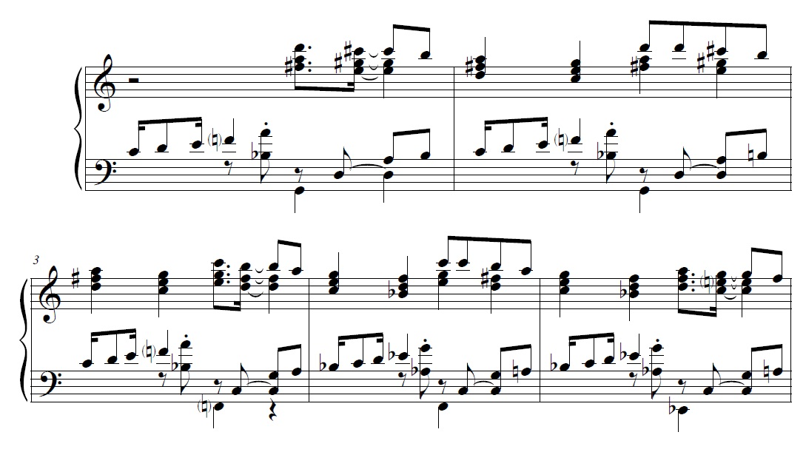

## Década de 1940:

Como:
- tornar-se nacionalista sem ser atraído para a órbita de VL?
- abandonar o dodecafonismo em favor do nacionalismo nesse cenário?

## é disso que quero falar; de algumas das soluções do GP

- materiais brasileiros não explorados - RECIFE e interior de SP

- formas mais "modernas" de *tratar* o material nacional

## curiosamente, técnicas mais tradicionais servem de *base*:

- período já de refluxo das vanguardas do início do século ("retorno à ordem")

- lógica e coerência formal importam 

- elemento nacional tendia a ser visto como incongruente e/ou insuficiente para as demandas formais da música de concerto 

- GP diz que a transposição do material popular é um problema ainda maior que o dodecafônico (carta a CL 1951)

### Harmonia Acústica tem papel fundamental aqui como técnica "neutra"

## Suíte para quarteto ou orquestra de cordas

- uma de suas primeiras peças nacionalistas

- 1949: "Compus no Recife, experimentando as danças nacionais. Não é composição dodecafônica, pelo contrário empreguei certas constâncias da harmonia popular brasileira." (GUERRA-PEIXE, 1949)

- não sabemos bem o que seriam "constâncias da harmonia popular brasileira"

#### polimodalidade

- terças paralelas não-diatônicas (ostinato grave) - *sib* nos vlc, *si natural* nas vlas

- não há conflito de modo entre o ostinato e a melodia, mas
    - melodia sugere *Si* como centro
    - harmonia sugere *Mi*
        - ver glissando *lá-si* (cadência subtônica-tônica, Si mixo)
        - mas forma uma quinta aberta *mi-si* com vln2 - centro em *Mi*
    
    - a melodia cadencia ali, mas o mov do vln2 desenha (grave->agudo, começando na 4a colcheia do compasso 2):
        - fá#-si (4J, centro: *Si*)
        - mi-si (5J, centro: *Mi*)
        - mi-lá (4J, centro: *Lá*)
        - mi-si (5J, centro: *Mi*, coincidiria com ostinato, apesar da cadência melódica sugerir *si*, mas o ostinato vai para *Sol*)
        - ré#.fá#-si (arpejo de *SiM*, ostinato volta para *Mi*)
    
    - como se vê, são dois planos tonalmente paralelos, os violinos e o ostinato

## Pedinte - mov 3 da Suíte n^o^ 2 - Nordestina, para piano (1954)

### Recursos mais sutis, mas o mesmo procedimento de sobrepor modos

- compassos 1-2 (da figura, 3-4 da peça):
    - Ostinado: *Sol mixo* (m.e.), quintas justas e depois graus conjuntos e a sétima percussiva *sib-lá*
    - m.d.: motivo principal *ré-dó#-si-lá-sol*
        - Sol lídio com proeminência do *dó#* (síncope)
        - harmonizado em tríades paralelas com Ré lídio (fá#, sol# etc.)
        - depois transpõe para *Dó lídio*
    - m.e.: fá natural, *Sol mixo*

- depois tudo é transposto sucessivamente para *Fá*, *Mib*, passando de lídio para dórico, e, por fim, *Mi*

## Questões:

### Por que Guerra-Peixe opta por esses recursos ao produzir música de caráter brasileiro?

- Tenta "diluir" o excessivamente característico do modo
- transposição abrupta complexifica, "cromatiza" sem soar cromático

## Esses procedimentos na tradição de concerto do XX

### Bartók (apud Antokoletz 1992: 94), que entendia de folclore, vê coisas muito parecidas no Pribaoutki:
- parte vocal: motivos curtos que Strav imita do folc russo
    - separadamente os motivos são tonais
    - mas são acompanhados por fragmentos mais ou menos atonais, que guardam algo dos motivos

### Milhaud (1982: 173-188), que foi o principal teórico do politonalismo

- diatonismo/cromatismo = politonalismo/atonalismo
- politonalidade é a continuidade do diatonismo na tradição
    - Milhaud apresenta indícios dela em compositores anteriores
        - assim como Webern vê do dodecafonismo no passado
    - em seguida M fala do politonalismo de seus contemporâneos

### Técnicas politonais

- **Contraponto de acordes**
    - similar ao do Pedinte, entre as duas mãos

- **Politonalidade contrapontística**
    - em vez de sobrepor **acordes ou encadeamentos**, **melodias** em tons diferentes são tocadas simultaneamente

## Duas formas de politonalismo

### P. CONTRAPONTÍSTICO
    - visa à criação de planos simultâneos ou que se alternam rapidamente, cada um deles em uma tonalidade diferente

### P. HARMÔNICO
    - empilha acordes ou escalas para gerar estruturas harmonicamente mais complexas MAS que tenderiam a ser ouvidas como entidades em si

#### São tipos ideais, claro

- Tudo isso poderia levar, no limite, a um **resultado atonal**
    - mas politonalismo é essencialmente diatônico
    - ### os materiais que lhe servem de base (melodias e harmonias) são essencialmente diatônicos
    - atonalidade é cromático, se baseia no acorde de sétima da dominante e todos os acordes são potencialmente uma forma deste, levando a um movimento constante entre tonalidades

- PORTANTO, para M, o caráter politonal ou atonal de uma obra é determinado pela melodia
    - ### e as necessidades orgânicas dela, que devem ser ouvidas e atendidas
        - importância da ideia de coerência entre material e meios de escrita
            - é o problema da transposição da música brasileira para a erudita de que GP falava

## Essas técnicas permitem criar complexidade sem descaracterizar os materiais que servem de base

### Maracatu é paradigmático:
    - o efeito quase tímbrico do ostinato é para complexificar e dar um som contemporâneo
    - as linhas paralelas (vlc+vla x vlns) são planos paralelos, logo contraponto

### O Pedinte mostra a complexificação da textura e do conteúdo harmônico, bem como a existência de planos distintos
### - mas permite ver tb a diluição do elemento característico (**IMPORTANTE**)

## Em termos mais gerais
- vemos que a opção de GP pelo nacionalismo e a pesquisa folclórica não significou trocar a tradição de concerto por outra tradição
- podemos ver como ele tentou juntar as duas coisas:
    - usou técnicas contemporâneas da trad de concerto para trabalhar os materiais de outra trad
    - fez essa outra tradição funcionar pela lógica da primeira
        - sem perder sua lógica própria, no entanto
        - é uma linha tênue sobre a qual andar
        - e a politonalidade parece ter sido um dos mecanismos encontrados para isso em sua bagagem técnica

    - mas mesmo isso iria mudar conforme a coisa caminhou
        - essas duas peças são iniciais
        - exemplo interessante é o Quarteto 2, já posterior, 1958
            - que não vamos tratar aqui
